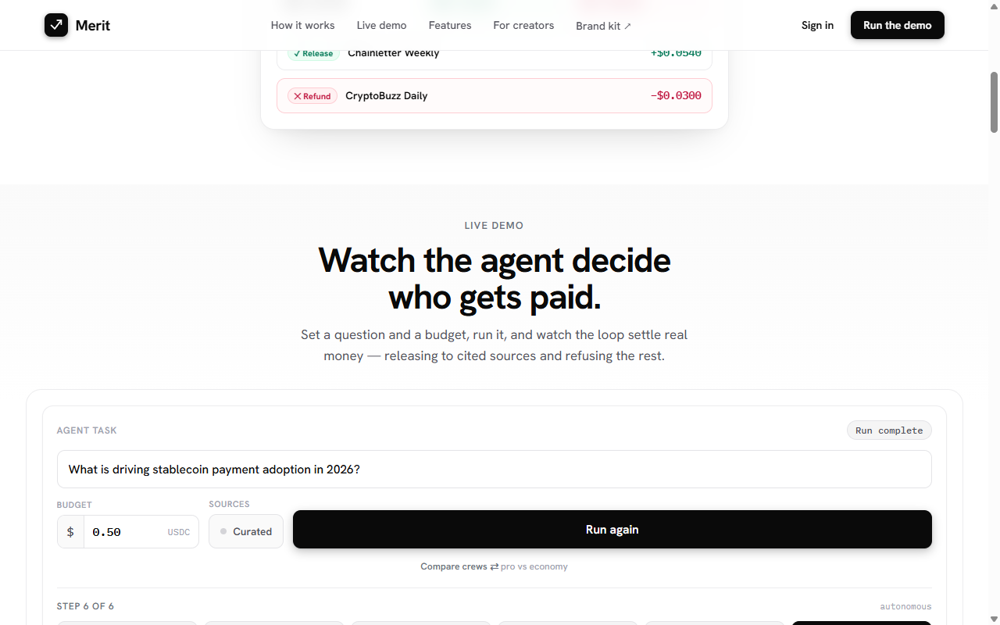

<div align="center">


# Merit

### Agents pay creators on merit.

**A proof-of-work economy for AI agents, on Arc.** A lead agent escrows USDC, verifies every
citation, and releases sub-cent payment **only for work that verifies** — refunding the rest —
with a **signed, self-proving receipt** for every decision.

<p>
<a href="https://merit-ecru.vercel.app"></a>


</p>

<br />

<a href="https://merit-ecru.vercel.app"></a>

<br /><br />

**[▶ Live demo ↗](https://merit-ecru.vercel.app) · [The moat ↓](#-the-moat--proof-of-citation-gates-settlement-on-chain) · [How it works ↓](#-at-a-glance) · [Quickstart ↓](#-run-it) · [Verify everything ↓](#-dont-trust--verify) · [Deployed contracts ↓](#deployed-on-arc-testnet-chain-5042002)**

</div>

---

> **The one-liner:** anyone can pay — only Merit decides who *earned* it. Settlement is gated on
> whether the cited **work is correct**, the one tier the agent economy leaves unguarded.

## ⚡ What it is

Give Merit a question + a USDC budget and a **lead agent** runs an autonomous research firm. It
**hires specialist agents** — *search → write → verify* — and pays each in sub-cent USDC **only for
work that verifies**, then pays the **creators** whose sources it actually cited
(**proof-of-citation**), refunding everything that doesn't check out. Every payment is real, settles
on **Arc**, and writes **portable on-chain reputation** (ERC-8004) for *both* the agents and the
creators.

It's **two-sided** — *agent → agent* (the lead hiring its crew) and *agent → creator* (paying the
cited sources) — a settlement + trust layer for an agent economy, not just an app. Built on **Arc
testnet** with **Circle Nanopayments** (x402 + Gateway batching), real LLM reasoning + an
**adversarial proof-of-citation judge**, and **all three ERC-8004 registries** (identity, reputation,
validation).

## 🔭 At a glance

```text
   question + USDC budget
            │
            ▼
   ┌─────────────────┐   hires + pays each per job (x402, ONLY for verified work)
   │   LEAD AGENT    │ ───────────────────────────────────────────────▶  CREW   (agent → agent)
   │     (buyer)     │                                        SEARCH   Scout · Ferret
   └────────┬────────┘                                        WRITE    Scribe · Quill
            │                                                 VERIFY   Auditor · Tally
            │   proof-of-citation — the Auditor judges each claim     (pro · budget tiers)
            ▼
   cited + verified + supported    ─▶  release sub-cent USDC to the CREATOR   (agent → creator)
   uncited / unverified / refuted  ─▶  refund, with the reason shown
            │
            ▼
   real USDC on Arc  ·  ERC-8004 reputation (agents + creators)  ·  signed summary receipt
```

## 🛡️ The moat — proof-of-citation gates settlement, on-chain

Merit's settlement is a native **ERC-8183 job** whose escrow release is gated by an **`IACPHook`**
that embodies proof-of-citation — so money moves *only* if the cited work verifies. Not asserted —
**deployed and proven**:

- ✅ **A verified run RELEASES the escrow; a failed citation REVERTS `complete()` and refunds.** Proven
  on-chain: `MeritJob` job 1 = `Completed` (citation verified), job 2 = `Rejected` (citation failed —
  the hook blocked the release). The release is bound to `keccak256` of the signed receipt; anyone can
  verify via `jobs(id)` + `verdictOf(host, id)`. (`MERIT_HOOK_ONCHAIN=1`)
- 📊 **The evaluator is *measured*, not asserted** — a forkable, false-negative-gated benchmark
  scoring **100% precision / recall** on a balanced gold set. See
  [`BENCHMARK.md`](BENCHMARK.md) · `npm run judge-eval`.

> Nobody else in the Arc / agent-economy ecosystem gates settlement on whether the **work is correct**
> — they gate on identity, a reputation score, or attested execution. **Proof-of-citation as the
> settlement gate is Merit's unoccupied moat.**

### Deployed on Arc testnet (chain `5042002`)

| Contract | Role | Address |
|---|---|---|
| **MeritJob** | ERC-8183 job + escrow | [`0xdF81…6A05`](https://testnet.arcscan.app/address/0xdF81dCCFf8c8ea9e1fB6B5b2B790fAfF1Ebe6A05) |
| **MeritVerificationHook** | proof-of-citation settlement gate | [`0xA30f…9ab1`](https://testnet.arcscan.app/address/0xA30f58f60725a978Ac09034F4FDd32efc29e9ab1) |
| Escrow | conditional release/refund | [`0xbCaE…03Cd8`](https://testnet.arcscan.app/address/0xbCaEA25F7D3E64B337BeB4342945544970B03Cd8) |
| Stake | source staking + slashing | [`0xFb10…ED6c`](https://testnet.arcscan.app/address/0xFb1090d03f0915cBd3930231Cf0A388B7a07ED6c) |
| Insurance | reputation-underwritten guarantees | [`0xB90F…58A2`](https://testnet.arcscan.app/address/0xB90Fd2a103750a4a9a0Bb368B9bADA0a786A58A2) |
| PredictionMarket | crowd-confidence on contested citations | [`0xb67C…EE6e`](https://testnet.arcscan.app/address/0xb67C595d1F13E01fFF1a5690B938A249fE1eEE6e) |
| AttestationVerifier | on-chain signed-verdict check | [`0xD632…a297`](https://testnet.arcscan.app/address/0xD632eabAb9431aFa724522a196CEf7518016a297) |

Full record in [`contracts/deployments.json`](contracts/deployments.json).

## 🚀 Run it

```bash
npm install
npm run start          # production server (recommended); or: npm run dev
#  →  http://localhost:3000
```

With `STUB=1` the whole loop runs **offline** (templated answer, simulated hashes, file-backed
registries) — zero deps, good for building or recording. Open `/`, set a question + budget, hit
**Run agent**, and watch the lead **hire + pay its crew**, settle to creators, refuse the rest, and
write reputation — live on screen. Every run ends in a **signed, verifiable receipt** with a
Download button; **click any creator** for its on-chain reputation, or hit **Compare crews** to see
the pro-vs-economy verification market side by side.

<details>
<summary><b>Go live on Arc testnet</b> — real USDC settlement</summary>

1. **Fund** at <https://faucet.circle.com> (Arc-testnet USDC):
   - `BUYER_*` — the lead/buyer wallet (Gateway deposit + gas + pays specialists, creators, and
     ERC-8004 feedback). Specialists + creators are receive-only.
   - `OPERATOR_*` — identity registrar; a little native USDC for mint gas (only if `REPUTATION_ONCHAIN=1`).
2. **Set keys** in `.env.local`:
   - `LLM_API_KEY` — NVIDIA `nvapi-…` or OpenAI `sk-…` (auto-detected), with
     `LLM_BASE_URL` / `LLM_MODEL` / `EMBED_MODEL` / `EMBED_INPUT_TYPE`.
   - `STUB=0` to settle real USDC; `REPUTATION_ONCHAIN=1` to write ERC-8004 for real.
   - Optional Supabase (`SUPABASE_URL` + `SUPABASE_SERVICE_ROLE_KEY`) — durable receipts mirror.
3. `npm run build && npm run start`.

> ⚠️ Next does **not** override env vars already set in your shell. Unset a stale
> `OPENAI_API_KEY` / `LLM_API_KEY` so `.env.local` wins.

</details>

## 📣 For creators — get listed in one click

Any publisher joins in **one step** and earns USDC every time an agent *verifiably* cites their work — no
account, no key handed to Merit (the payout wallet is receive-only).

```bash
# paste an RSS/Atom feed → a citable, payable creator with an on-chain (ERC-8004) identity
npm run onboard-feed https://yourblog.com/feed.xml
```

…or open **`/onboard.html`** in the browser and paste your feed there. To direct payouts to **your own**
wallet (instead of a Merit-generated one), add a single line anywhere in your feed and re-onboard:

```
merit-verify:0xYourWalletAddress
```

Merit reads your recent posts, registers you, and from then on **every verified citation settles sub-cent
USDC to your wallet on Arc** — hallucinated or unsupported citations pay nothing. That's the whole point.

**16 real public feeds are already indexed** as citable creators — HuggingFace, Vitalik, Ethereum Foundation,
OpenAI, CoinDesk, Cloudflare, GitHub, Krebs, Paul Graham, WIRED, Ars Technica… each with a receive-only wallet
+ an on-chain ERC-8004 identity. See **[PUBLISHERS.md](PUBLISHERS.md)** (honestly labeled: permissionless
listings, the model keryx used — an owner-verified creator via `merit-verify:` is the stronger signal).

## 🤝 The agent-labor market

The lead agent doesn't do the work itself — it **hires a crew** from an open pool of specialist
agents and pays them per job, exactly like it pays creators:

- **Search / Write / Verify** specialists each expose a wallet, a price, and a **capability**. The
  tiers genuinely differ: the pro **Scribe** cites every supported claim and the pro **Auditor**
  runs the adversarial LLM judge; the budget **Quill** writes terser and the budget **Tally** checks
  by **similarity only** — no judge, so it can't catch a hollow citation. *Cheaper labor,
  structurally weaker verification.*
- The lead **hires the highest-reputation** specialist per role — reputation *gates* the market. Opt
  into the **economy crew** with `{"tier":"budget"}`; `npm run compare-crews` shows them side by side.
- Specialists **deliver first, are graded on verified output, then paid or refused** — the same
  escrow → verify → release Merit uses for creators. Each accrues **on-chain ERC-8004 reputation**.

Each specialist is a **standalone x402 service** (its pay endpoint returns a real `payment-required`
challenge, payTo = its own wallet), so any external agent — not just this lead — can discover and pay
it. The market is open, not internal plumbing.

> **Why Arc:** one research job is dozens of sub-cent agent-to-agent payments. On card rails the fees
> exceed the labor; on a gas-metered chain, gas kills the loop. Arc's gasless, sub-cent, sub-second
> USDC settlement is what makes agent labor economically viable at all.

## 🌐 Two source modes

- **Curated** (default) — a stable seven-source pool for a reliable demo (six publishers + a
  cited-but-unsupported **trap** only the Auditor catches — refused in every run).
- **Live web** — the agent discovers **real publishers** live from RSS (CoinDesk, Cointelegraph,
  Decrypt, PYMNTS, The Block, CryptoSlate, Bitcoin Magazine), reads their content, and pays the ones
  it cites; reputation accrues **per domain**. Real creators can onboard with their own wallet + a
  content sample. Toggle **Sources → Live web**, or send `{"discover":true}` to `/api/run`.

## 🔍 Don't trust — verify

Every claim Merit makes is independently recomputable from Arc, with **no Merit server**:

| Command | Proves |
|---|---|
| `npm run verify-receipt -- <receipt.json> [buyer]` | the **signed receipt** offline — recovers the signer; any altered verdict/amount breaks the signature |
| `npm run recompute -- <agentId>` | an agent's **ERC-8004 reputation** straight from Arc (raw `eth_getLogs`), no server, no cache |
| `npm run verify-settlement -- <wallet>` | the **money moved** — sums the USDC Transfer logs a payout wallet actually received |
| `npm run verify-all -- <receipt.json> [buyer]` | the **whole receipt** — signature + every paid/refused verdict cross-checked against the ValidationRegistry. The receipt *cannot lie* |
| `npm run judge-eval` | the **moat, measured** — 16-pair gold set through the live Auditor → 100% P/R/F1 (a wrongful pay fails the run) |
| `npm run prove -- <receipt.json>` | the **whole run** — facts from chain **plus** judgment re-audited live |

<details>
<summary><b>All scripts</b> (25 — the full toolbox)</summary>

| command | what it does |
|---|---|
| `npm test` | 277 unit tests (vitest) over the pure logic — the agency decision table, crew grade + whole-run budget-guard (`gradeSpecialist`/`withinBudget`), the run-receipt settlement-integrity rule (`summarizeRelease`), proof-of-citation matching (`citingSentence`, `parseJudgeVerdict`, `verifyCitations`, the pure `decideCitation` payment logic + the deterministic numeric verifier `fabricatedFigures`), RSS/Atom parsing, registry persistence, specialist hiring/grading/merit, the run rate-limiter, the LLM circuit-breaker, the off-topic guard, the monotonic settlement ledger, and the no-secret-leak views |
| `npm run smoke` | end-to-end (54 checks): sources, full run, ledger consistency, the summary receipt, no private-key leak, the agent-labor market, a zero-budget pays-nothing invariant, off-topic pays no creators, onboarding, on-chain reputation, the MCP handshake, `verify-all`, `leaderboard`, the `challenge` re-audit |
| `npm run prove-moat` | one command: a verified run **releases** the ERC-8183 escrow; an off-topic run **reverts** `complete()` via the hook, then refunds — the moat enforced on-chain |
| `npm run audit-demo` | feeds the Auditor a genuine citation, two contradictions, and a **prompt-injection** — pays the real one, refuses the rest |
| `npm run prove-reputation` | mints an ERC-8004 identity + writes feedback on Arc, prints arcscan links |
| `npm run reputation -- [id]` | an agent's **portable track record** — its full on-chain feedback timeline recomputed live from Arc |
| `npm run recompute -- <agentId>` | **server-free** reputation rebuild straight from Arc (`eth_getLogs` + int128 decode) |
| `npm run leaderboard` | ranks the whole two-sided market (specialists *and* creators) by ERC-8004 reputation on Arc |
| `npm run verify-validation -- <tx>` | decode a receipt's validation tx + read the ValidationRegistry verdict (100=paid / 0=refused) |
| `npm run verify-receipt -- <receipt.json> [buyer]` | recover the signer offline; pin to the payer; any tamper breaks the signature |
| `npm run verify-settlement -- <wallet>` | sum the USDC Transfer logs a payout wallet received — the money, recomputable |
| `npm run verify-all -- <receipt.json> [buyer]` | the whole receipt cross-checked against chain — it cannot lie |
| `npm run prove -- <receipt.json> [buyer]` | `verify-all` + `challenge` — facts from chain plus judgment re-audited |
| `npm run challenge -- "<source>" "<claim>"` | **appeal a verdict** — re-run the proof-of-citation judge on a (source, claim) pair |
| `npm run judge-eval` | **judge the judge** — the 16-pair gold set → accuracy / precision / recall / F1 (currently 100/100/100) |
| `npm run mcp` | **MCP server** — Merit as one callable tool (`merit_research`) over stdio for any MCP client |
| `npm run preflight` | pre-deploy doctor — env, key→address derivation, funding, LLM reachability → READY / NOT READY |
| `npm run example -- "question" [--discover]` | drive a run programmatically (no browser); `--discover` pulls live web sources |
| `npm run external-hire -- scout` | act as an **external** agent: discover a specialist's x402 challenge + pay it directly |
| `npm run creator-market` | a brand-new creator onboards via the public register endpoint + gets paid for a verified citation |
| `npm run compare-crews` | the same question through the **pro** vs **economy** crew, side by side |
| `npm run moat-value` | quantifies what a *pay-then-pray* rail wastes vs Merit paying only for verified value |
| `npm run reset-demo` | restore a clean demo state (fresh merit, drop test creators, keep cached agentIds) |
| `npm run generate-wallets` | generate the buyer/operator/seller EOAs |

</details>

## 🧩 Use Merit from any MCP client

Merit ships an **MCP** (Model Context Protocol) server — any MCP-aware agent (Claude, Gemini CLI,
Cursor) can call Merit as a tool. Start Merit, then point the client at it:

```json
{
  "mcpServers": {
    "merit": {
      "command": "node",
      "args": ["scripts/mcp-server.mjs"],
      "env": { "MERIT_BASE": "http://localhost:3000" }
    }
  }
}
```

One tool — **`merit_research`** (`question`, optional `budget` / `discover` / `tier`) — runs the full
loop and returns the answer **plus the receipt**: who was paid or refused and why, with Arc tx links.
The caller doesn't just get an answer; it gets one whose every citation was paid for *only if it
verified*. (Dependency-free stdio JSON-RPC; no SDK.)

<details>
<summary><b>Architecture</b></summary>

- `lib/agent.ts` — the **lead** orchestrator: hire crew → escrow → grade + pay (agent→agent) →
  release/refund creators (agent→creator) → write ERC-8004 reputation for both. Whole-run budget cap,
  settlement resilience, abort-on-disconnect.
- `lib/job.ts` — the **hook-gated ERC-8183 settlement** (`settleViaHook`): drives MeritJob +
  MeritVerificationHook on-chain so a real run's escrow release is gated by the proof-of-citation verdict.
- `lib/specialists.ts` — the specialist-agent registry (labor supply): stable wallets, reputation,
  pro/budget tiers, the `pickSpecialist` reputation-gated hiring rule.
- `lib/llm.ts` — provider-agnostic generation + the Auditor's proof-of-citation: an adversarial LLM
  judge (`judgeCitation`) decides whether each source backs the exact claim citing it, with
  asymmetric-embedding similarity as the evidence score. Catches on-topic-but-unsupported citations.
- `lib/numcheck.ts` — the **deterministic numeric verifier** (`fabricatedFigures`): a $/% figure the
  source contradicts is refused with **no LLM**.
- `lib/seller.ts` / `lib/pay.ts` — x402 seller wrapper (per-payee `payTo`, Circle Gateway batching) +
  buyer-side `GatewayClient` deposit + nanopayment settle.
- `lib/reputation.ts` — ERC-8004 across all **three** registries (identity mints, Reputation
  feedback, and the proof-of-citation verdict to the ValidationRegistry — no self-attest).
- `lib/ledger.ts` — the append-only, **monotonic** settlement counter (never falls on reset).
- `lib/runctx.ts` — in-process run context; only an unguessable `runId` crosses the x402 wire.
- `app/api/*` — the API: `/api/run` (SSE, rate-limited, ends with the self-contained `summary`
  receipt), `/api/agents` (the specialist marketplace), `/api/reputation/[id]` (recomputed from chain).

</details>

## 📡 On-chain references (Arc testnet, chain `5042002`)

USDC [`0x3600…0000`](https://testnet.arcscan.app/address/0x3600000000000000000000000000000000000000) ·
ERC-8004 Identity `0x8004A8…BD9e` / Reputation `0x8004B6…8713` / Validation `0x8004Cb…4272`. Agent
payments, creator settlements, identity mints, feedback, and validation writes are all verifiable on
[`testnet.arcscan.app`](https://testnet.arcscan.app). Built on `circlefin/arc-nanopayments` + `arc-escrow`.

## License

[Apache-2.0](LICENSE) © Merit

<div align="center"><sub>Anyone can pay — only Merit decides who <i>earned</i> it.</sub></div>
