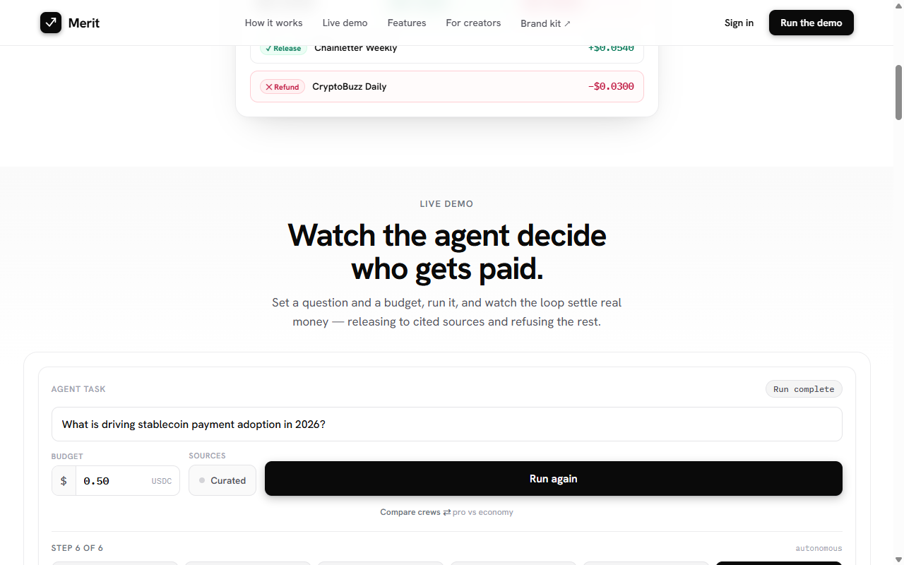

<div align="center">


# Merit

**Agents pay creators on merit.**

A proof-of-citation payment layer on Arc. A lead agent escrows USDC, verifies every citation
it makes, and releases sub-cent payment only for the claims that actually check out. Everything
else is refused before a cent moves, and every decision returns a signed receipt anyone can
recompute without trusting a Merit server.

<p>
<a href="https://onmerit.xyz"></a>
<a href="https://youtu.be/MuV-c3yaQwY"></a>


</p>

<p>


</p>

<br />

<a href="https://onmerit.xyz"></a>

<br /><br />

[Live demo](https://onmerit.xyz) &nbsp;·&nbsp; [2-min video](https://youtu.be/MuV-c3yaQwY) &nbsp;·&nbsp; [Product page](https://comfortable-goal-205.notion.site/Merit-3939c0ce78768113a3c6d659ea8a1f5d) &nbsp;·&nbsp; [What it is](#what-it-is) &nbsp;·&nbsp; [How it works](#how-it-works) &nbsp;·&nbsp; [Settlement](#settlement-is-gated-on-verification) &nbsp;·&nbsp; [Quickstart](#quickstart) &nbsp;·&nbsp; [Verify everything](#verify-everything) &nbsp;·&nbsp; [Contracts](#deployed-contracts)

</div>

---

> Anyone can send money. Merit decides who earned it. Settlement is gated on whether the cited
> work is correct — the check most agent-payment stacks skip.

**[ETHOnline 2026 · Arc submission →](SUBMISSION.md)** — which prizes, and the evidence for each.

**[Architecture diagram →](docs/ARCHITECTURE.md)** · **[live](https://www.onmerit.xyz/architecture.html)** — the system, the money path, the verification engine, and where every Circle and Arc product is used.

## Contents

- [What it is](#what-it-is)
- [How it works](#how-it-works)
- [Settlement is gated on verification](#settlement-is-gated-on-verification) · [Deployed contracts](#deployed-contracts)
- [The verification oracle](#the-verification-oracle)
- [What the oracle makes possible](#what-the-oracle-makes-possible)
- [Quickstart](#quickstart)
- [For creators](#for-creators)
- [The agent-labor market](#the-agent-labor-market)
- [Source modes](#source-modes)
- [Verify everything](#verify-everything)
- [API surface](#api-surface)
- [MCP integration](#mcp-integration)
- [On-chain references](#on-chain-references)

---

## What it is

Give Merit a question and a USDC budget. A lead agent runs the job: it hires specialist agents
(search, write, verify), pays each one in sub-cent USDC only for work that verifies, then pays the
creators whose sources it actually cited. Unsupported or fabricated citations are refused, and the
budget they would have spent is returned.

Two payment paths run through the same gate. Agent to agent, the lead pays the crew it hires. Agent
to creator, it pays the sources it cites. Both settle only against verified work, and both write
portable on-chain reputation (ERC-8004) for the parties involved.

Run with `STUB=0` and every payment is real USDC on Arc. The hosted demo runs in a clearly labeled
stub mode with the same logic and simulated settlement. The stack is Arc testnet, Circle x402 (the
HTTP-native agent-payment standard) with Gateway batching, real LLM reasoning, an adversarial
proof-of-citation judge, and all three ERC-8004 registries: identity, reputation, and validation.

## How it works

```text
   question + USDC budget
            │
            ▼
   ┌─────────────────┐   hires + pays each per job (x402, only for verified work)
   │   LEAD AGENT    │ ──────────────────────────────────────────────→  CREW   (agent → agent)
   │     (buyer)     │                                       SEARCH   Scout · Ferret
   └────────┬────────┘                                       WRITE    Scribe · Quill
            │                                                VERIFY   Auditor · Tally
            │   proof-of-citation: the Auditor judges each claim    (pro · budget tiers)
            ▼
   cited + verified + supported    →  release sub-cent USDC to the CREATOR   (agent → creator)
   uncited / unverified / refuted  →  refund, with the reason shown
            │
            ▼
   real USDC on Arc  ·  ERC-8004 reputation (agents + creators)  ·  signed receipt
```

## Settlement is gated on verification

Merit's settlement runs as an ERC-8183 job (the on-chain agent-job and escrow standard) whose escrow
release is controlled by a settlement-gate contract, `IACPHook`. The gate encodes proof-of-citation:
escrow releases only when the cited work verifies. This is deployed and exercised on-chain, not just
described.

- A verified run releases the escrow. A failed citation reverts `complete()` and refunds. On Arc,
  `MeritJob` job 1 is `Completed` (citation verified) and job 2 is `Rejected` (citation failed, the
  hook blocked the release). The release is bound to `keccak256` of the signed receipt; check it with
  `jobs(id)` and `verdictOf(host, id)`. Enabled by `MERIT_HOOK_ONCHAIN=1`.
- The evaluator is measured, not asserted: a forkable **275-case adversarial benchmark** spanning 14 failure
  modes (fabricated figures, contradiction, off-topic, right-entity-wrong-attribute, temporal error,
  overgeneralization, prompt-injection, and more), each label independently double-checked. Measured result:
  **100% recall** — every adversarial case caught, so nothing false reached settlement (197 held, 0 slipped) —
  at **90.4% precision / 94.9% F1**, 97% coverage. The verifier is conservative *by design*: it over-refuses
  ~30% of genuinely-supported claims rather than risk paying for one that isn't — the safe direction for money.
  Reproduce with `npm run bench-judge`; details in [`BENCHMARK.md`](BENCHMARK.md).

Most Arc and agent-economy projects gate payment on identity, a reputation score, or attested
execution. None gate on whether the work is correct. Gating settlement on citation correctness is
where Merit differs.

### The verdict travels inside the payment

A signed verdict served by `onmerit.xyz` still asks a reader to trust `onmerit.xyz`. Arc's predeployed
`Memo` contract removes that step. Merit wraps every payout in it, so the transaction itself carries
which verified work it settled:

- **`memoId`** is derived from the payout's own settlement digest — a `bytes32` anyone can query
  `Memo` events by, with no Merit server in the loop.
- **`memoData`** is compact JSON naming the `verificationId`s (or run id) behind the money, plus the
  amount and a digest covering the full set even when the id list is truncated to fit.
- **`callDataHash`** binds the memo to *that exact* `transfer(to, amount)` — a memo cannot be stapled
  onto a different payment.
- The **`CallFrom`** precompile preserves the operator EOA as `msg.sender`, so each creator's USDC
  `Transfer.from` reads as Merit's wallet, never a wrapper contract.

A domain claiming several balances (its source plus each co-author split) settles them in **one** Arc
transaction via `Multicall3From`, all-or-nothing, each line carrying its own memo. Read any payment
back at [`/reconcile.html`](https://onmerit.xyz/reconcile.html) or `GET /api/memo?tx=…`.

### The ledger is audited against the chain

`/proof` is Merit's account of what Merit settled. [`/reconcile.html`](https://onmerit.xyz/reconcile.html)
is the audit of that account, run against Arc in both directions: every published settlement is re-read
from chain logs and checked against **both** of Arc's USDC emitters — the 18-decimal native system log
(EIP-7708) and the 6-decimal ERC-20 log — and a bounded scan of outbound USDC flags anything the ledger
does not explain. Arc's RPC caps a log query at 10,000 blocks, so the scan always states the window it
covered; a clean scan means "nothing unexplained in this window", never "nothing unexplained ever".

### Funding without holding gas (EIP-3009)

Gas on Arc is USDC, so a wallet holding exactly what it means to spend cannot spend it. `POST /api/relay`
takes a signed `TransferWithAuthorization` and broadcasts it from Merit's relayer, which pays the gas —
the payer signs and never sends a transaction. Verified end to end on Arc testnet with a wallet whose
nonce stayed at zero across the transfer. Replay is blocked by `authorizationState`, and a redirected or
over-value authorization is refused before any gas is spent.

Run the whole layer against real Arc testnet USDC with `npm run verify-arc-native`.

### Deployed contracts

Arc testnet, chain `5042002`:

| Contract | Role | Address |
|---|---|---|
| `MeritJob` | ERC-8183 job and escrow | [`0xdF81…6A05`](https://testnet.arcscan.app/address/0xdF81dCCFf8c8ea9e1fB6B5b2B790fAfF1Ebe6A05) |
| `MeritVerificationHook` | proof-of-citation settlement gate | [`0xA30f…9ab1`](https://testnet.arcscan.app/address/0xA30f58f60725a978Ac09034F4FDd32efc29e9ab1) |

These two are the settlement path; `lib/job.ts` gates release on the hook's verdict. Additional
forge-tested contracts explored during development (Escrow, Stake, Insurance, PredictionMarket,
AttestationVerifier) are recorded in [`contracts/deployments.json`](contracts/deployments.json) but
are not on the default settlement path.

## The verification oracle

The judge is available on its own, so any agent can check a citation before paying for it.

- **Free tier.** `POST /api/verify` takes a raw `(claim, source)` pair and returns a signed verdict:
  `SUPPORTED` or `REFUSED`, with the layers that decided it. The response includes a `signed` object
  carrying the exact bytes that were signed, so a caller recovers the signer offline and confirms the
  verdict without trusting the server. Altering any field breaks the signature.
- **Metered tier.** `POST /api/verify/paid` is the same oracle behind an x402 paywall, discoverable at
  [`/.well-known/x402`](https://onmerit.xyz/.well-known/x402).
- **Signed receipts.** Every verified citation becomes a shareable receipt at `/v/<id>`, and
  `GET /api/card/<id>` returns its `signed` object for offline recovery. The receipt is checkable with
  `scripts/verify-receipt.mjs` and never depends on a live server.

Two layers decide each verdict. A deterministic numeric verifier (`lib/numcheck.ts`) refuses any
figure the source contradicts with no LLM at all. An adversarial LLM judge (`lib/llm.ts`) then checks
whether the source actually supports the exact claim citing it, catching on-topic-but-unsupported
citations that similarity scoring alone would pass.

> [Try to get a lie paid.](https://onmerit.xyz/break.html) Submit a fabricated citation on
> the live site and watch the verifier refuse it before a cent moves, with a running "attacks held"
> counter and every attempt harvested into the gold set. On a system that trusts the writer, the
> fabricated citation pays; here, the chain reverts.

## What the oracle makes possible

A deterministic verification oracle can settle things a toll booth or a marketplace cannot, because
each one is resolved against ground truth rather than an opinion.

- **Citation staking.** The writer bonds on every source it cites, and the Auditor's verdict settles
  each bet: passed returns the bond plus a premium, refuted slashes it. See the `stake` event in any
  run, where the cited-but-contradicted trap source is slashed.
- **Self-bootstrapping benchmark.** `GET /api/benchmark` logs the boundary-confidence citations from
  each run as gold-set candidates, so the benchmark co-evolves with real traffic instead of staying a
  static snapshot.
- **Economic scalable oversight.** `npm run tournament` runs a self-play tournament where agents stake
  on citations settled by the real verifier. Honesty emerges: always-liars go bankrupt, an agent that
  learns only from payoff converges to truth (P(honest) 0.50 to 1.00), and the market's false-citation
  rate falls from 43% to 0%. No agent is programmed to be honest; the economics make it the only way to
  survive. Writeup: [`docs/scalable-oversight.md`](docs/scalable-oversight.md).

### The hub — one oracle, every hat (for agents and humans)

Every competing project built a payment and skipped the reason to release it — they gate on identity,
reputation, uptime, relevance, or the generator's own say-so, because none has a ground-truth verifier.
Merit does, so the same proof-of-citation gate becomes every capability the agentic economy needs. Each
is live on the deployment and proven with a real on-chain outcome.

- **Verified Inference — the flagship** (`POST /api/inference`, [inference.html](https://onmerit.xyz/inference.html)).
  Don't sell AI tokens; sell AI proven to have run correctly (a 0G TEE hardware attestation) and proven to be
  right (Merit's verifier, whose judge is itself an attested 0G model). Merit resells 0G's TEE-attested models
  over x402 and staples proof to every answer; you pay per call in USDC on Arc, only if it verifies, and a wrong
  answer costs $0. Live: an attested DeepSeek-V4 completion with a real 0G handle (provider `0xB01EBd79…`, TDX /
  TeeTLS), and a verified answer where both the generation and the verification are TDX-attested → SUPPORTED,
  charged $0.004. Attested compute + verified output + on-chain settlement, fused. It now resells the **full live
  0G roster** — 13 TEE-attested chat models plus a vision model, both trust modes (Verified TeeML+TeeTLS / Private
  TeeML) and both API surfaces (OpenAI + Anthropic) — and **routes by verified-quality-per-dollar** (pass-rate²
  ÷ price, not cheapest). **Verified vision extraction** (`tier:vision`, qwen3-vl-30b) reads a figure from an image
  and grounds it in the model's own transcription; live: read `42B` from an image → SUPPORTED + attested.
- **Verified Citation Toll — the moat door** (`POST /api/toll/verify`, [toll.html](https://onmerit.xyz/toll.html)).
  A neutral gate any rail or publisher calls *before* releasing a per-citation payment: give it a claim + the cited
  source, it returns a signed release-or-refuse verdict on the same `verificationId`, and the rail pays only when the
  citation holds. The check Cloudflare / TollBit / ProRata skip — they pay on access, not on correct use. Live:
  SUPPORTED → release $0.002 (conf 0.987, all four gates, signed); a contradicted figure → REFUSE, $0.
- **ERC-8183 evaluator-of-record** (`POST /api/evaluator`).
  The reusable evaluator any *external* escrow drops into the ERC-8183 evaluator slot (usually a bare address with
  no logic): a signed `merit.gig/v1` accept/reject certificate its own hook settles on — Merit doesn't hold the
  escrow. Dispute = deterministic re-grade. Live: on-brief → release $0.05; off-brief → refund, $0.
- **Verify-gated x402 facilitator** (`POST /api/facilitator`).
  Pay any x402 seller, but keep the payment only if the delivered work verifies — a signed keep/dispute verdict on
  the content you paid for. Reuses the production-proven `payAndFetch` the scorecard uses. A rail that pays on
  HTTP-200 trusts blindly; Merit doesn't.
- **The Replayable Credit File** (`GET /api/credit-file`).
  Merit's verified-settlement history as a self-proving, clearing-compatible credit artifact (built for Arc's
  new Cycles clearing network, consumable by any app): a domain-separated Merkle root over the settlement
  entries, a raw export so any consumer recomputes every ratio without trusting Merit's math, a
  commit-to-settle ratio with refusals on the record (no survivorship bias), concentration entropy as the
  anti-wash signal, a staleness watermark, and an honest Sybil boundary — signed. Live: an external script
  recomputed the Merkle root from the raw export and matched.
- **Agent Treasury Guardrails** (`POST /api/guard/authorize`).
  Circle's framing is "agents holding discretion over balance sheets" — this is what makes that safe: one
  authorize call composing the kill-switch, Circle compliance, an admin-authored policy the spending agent can
  only read (anti self-escalation), rolling per-(principal, payee) exposure that defeats salami-slicing, and
  the tx simulation. Every decision — allow AND block — is itself a signed `merit.guard/v1` receipt persisted
  before the caller sees it; a human override chains to the blocked receipt naming the operator. Live: allow
  with all five gates evaluated; block carrying both the policy and exposure reasons, signed.
- **merit-verify SDK** — `npm i merit-verify` ([`packages/merit-verify`](packages/merit-verify)).
  The one-line integration, built as contracts not conventions: a REQUIRED `failureMode` constructor argument
  (outage behavior pre-committed at design time), local signature recovery against a pinned or discovered
  signer (never trust a boolean; unsigned verdicts fail closed against a known signer), and `verifyThenPay` on
  the server-signed payment binding — `bindingHash = keccak256(canonical {amount, payee, claim, sourceHash,
  nonce})` lives INSIDE the signed verdict, so a receipt for one payment can never authorize another, and a
  per-call nonce makes it one-receipt-one-payment. Ships as npm package + `llms.txt` with the full source
  embedded for paste-not-install coding agents.
- **Licensing-compliance audit** (`POST /api/license/audit`).
  Sample an AI output's claims against a licensed source and flag *misattribution* — claims credited to the source
  that it does not support — the audit layer bulk AI-licensing deals (OpenAI/Meta with publishers) lack. Live: 2
  claims → 1 supported, 1 misattributed → a signed royalty-true-up report.
- **Score any x402 endpoint** (`POST /api/score`, [scorecard.html](https://onmerit.xyz/scorecard.html)).
  Point Merit at any agent's paid endpoint with a claim it should back; Merit pays the toll, runs the
  delivered content through the verifier, and publishes a verified-quality-per-dollar leaderboard — the one
  axis a price/latency/uptime directory can't produce. Live: a three-gate SUPPORTED at 0.933 and a numeric REFUSE at 0.
- **Verified escrow board** (`POST /api/gigs`, [gigs.html](https://onmerit.xyz/gigs.html)).
  A bounty board for humans and agents: post a brief + requirements + a USDC bounty; a worker delivers;
  Merit's real adversarial grader releases the escrow only when every requirement is met — the evaluator
  Receipt/Arco/BugBountyAI shipped fake. Live: on-brief → ACCEPTED → ERC-8183 hook job released on-chain; off-brief → REJECTED, $0.
- **Ground-truth prediction market** (`POST /api/market`, [market.html](https://onmerit.xyz/market.html)).
  A pari-mutuel market on "will this claim verify?", settled by Merit's own verifier as the on-chain oracle —
  no human committee, no dispute window. Live: full stake → resolve → redeem on-chain against the deployed
  `PredictionMarket`.
- **Provenance-verified media licensing** (`POST /api/media`, [media.html](https://onmerit.xyz/media.html)).
  License a clip, image, or audio only if Merit verifies its own description + transcript genuinely support the
  request — the citation gate on a new modality. You never license media that isn't what it claims. Live:
  a match at 0.973 released the fee on-chain; a non-match → REFUSED, $0.
- **Cross-chain payout** (`POST /api/crosschain`, [crosschain.html](https://onmerit.xyz/crosschain.html)).
  Withdraw verified earnings from Arc to Base, Arbitrum, Optimism, or Avalanche via Circle Gateway. Live: a real
  Arc Gateway settlement tx; the cross-chain leg settles the moment the payout wallet holds destination-chain gas.

Each of these depends on the oracle. Without a ground-truth settlement layer, there is nothing to
settle a bet, grow a benchmark, price an equilibrium, score an endpoint, release an escrow, resolve a
market, or license a clip against.

## Quickstart

Requires Node 20 or newer.

```bash
npm install
npm run dev            # http://localhost:3000  (STUB=1 by default, no external deps)
npm run build && npm run start   # production build
```

With `STUB=1` the whole loop runs offline: templated answers, simulated hashes, file-backed
registries, zero dependencies. Open `/`, set a question and budget, and run. The lead hires and pays
its crew, settles to creators, refuses the rest, and writes reputation on screen. Each run ends in a
signed receipt with a download button. Click any creator for its on-chain reputation, or use Compare
crews to see the pro and economy verification tiers side by side.

<details>
<summary><b>Go live on Arc testnet (real USDC settlement)</b></summary>

<br />

**1. Fund** at <https://faucet.circle.com> (Arc-testnet USDC):

- `BUYER_*` — the lead wallet (Gateway deposit and gas; pays specialists, creators, and ERC-8004
  feedback). Specialists and creators are receive-only.
- `OPERATOR_*` — identity registrar; a little native USDC for mint gas, only if `REPUTATION_ONCHAIN=1`.

**2. Set keys** in `.env.local`:

| Variable | Purpose |
|---|---|
| `LLM_API_KEY` | NVIDIA `nvapi-…` or OpenAI `sk-…` (auto-detected), with `LLM_BASE_URL`, `LLM_MODEL`, `EMBED_MODEL`, `EMBED_INPUT_TYPE` |
| `STUB=0` | settle real USDC |
| `REPUTATION_ONCHAIN=1` | write ERC-8004 on-chain |
| `SUPABASE_URL` + `SUPABASE_SERVICE_ROLE_KEY` | optional durable receipt mirror |

**3. Build and run:** `npm run build && npm run start`.

Next does not override env vars already set in your shell. Unset a stale `OPENAI_API_KEY` or
`LLM_API_KEY` so `.env.local` wins.

</details>

## For creators

A publisher joins in one step and earns USDC each time an agent verifiably cites its work. No account,
and no key is handed to Merit; the payout wallet is receive-only.

```bash
# an RSS/Atom feed becomes a citable, payable creator with an ERC-8004 identity
npm run onboard-feed https://yourblog.com/feed.xml
```

Or open [`/onboard.html`](https://onmerit.xyz/onboard.html) and paste the feed there. To
direct payouts to your own wallet instead of a Merit-generated one, add a single line anywhere in the
feed and re-onboard:

```text
merit-verify:0xYourWalletAddress
```

From then on, every verified citation settles sub-cent USDC to that wallet on Arc. Hallucinated or
unsupported citations pay nothing.

Sixteen real publisher feeds are indexed as citable creators (HuggingFace, Vitalik, the Ethereum
Foundation, OpenAI, CoinDesk, Cloudflare, GitHub, Krebs, Paul Graham, WIRED, Ars Technica, and more),
each with a receive-only wallet and an ERC-8004 identity. The hosted demo serves a seven-source
curated pool. See [`PUBLISHERS.md`](PUBLISHERS.md); permissionless listings are honestly labeled, and
an owner-verified creator via `merit-verify:` is the stronger signal.

## The agent-labor market

The lead agent does not do the work itself. It hires a crew from an open pool of specialists and pays
them per job, the same way it pays creators.

- Search, write, and verify specialists each expose a wallet, a price, and a capability. The tiers
  genuinely differ: the pro Scribe cites every supported claim and the pro Auditor runs the adversarial
  judge, while the budget Quill writes terser and the budget Tally checks by similarity only, so it
  cannot catch a hollow citation. Cheaper labor buys structurally weaker verification.
- The lead hires the highest-reputation specialist per role, so reputation gates the market. Opt into
  the economy crew with `{"tier":"budget"}`; `npm run compare-crews` shows both side by side.
- Specialists deliver first, are graded on verified output, then paid or refused, following the same
  escrow-verify-release Merit uses for creators. Each accrues on-chain ERC-8004 reputation.

Every specialist is a standalone x402 service: its pay endpoint returns a real `payment-required`
challenge with `payTo` set to its own wallet, so any external agent can discover and pay it, not just
this lead.

**Traction.** Merit is early and already live with real on-chain activity. Its open x402 labor
market has settled 8,600-plus payments across 91 distinct agent wallets on Arc, each a real Circle
Gateway settlement you can resolve on the explorer, and the verified creator side has settled 191
citation payments with roughly 75% refused and paid nothing because they failed verification. We
label the source of traction plainly: some on-chain volume comes from our own agent fleet and
full-product test harness, and some came through Twitter-originated activity and conversations around
the product. We do not present the full number as purely organic external usage, and we also do not
present it as only internal testing. Broadening sustained external usage is the next phase, and the
on-ramps for it (creator onboarding, break-the-verifier) are already live. Labor volume is kept
deliberately distinct from the verified creator totals at [`/api/metrics`](https://onmerit.xyz/api/metrics)
so unverified activity never inflates the verified number. Detail in [`TRACTION.md`](TRACTION.md).

One research job is dozens of sub-cent agent-to-agent payments. On card rails the fees exceed the
labor; on a gas-metered chain, gas kills the loop. Arc's gasless, sub-cent, sub-second USDC settlement
is what makes agent labor viable at all.

## Source modes

- **Curated** (default): a stable seven-source pool for a reliable demo, including a cited-but-unsupported
  trap that only the Auditor catches and that is refused in every run.
- **Live web:** the agent discovers real publishers live from RSS (CoinDesk, Cointelegraph, Decrypt,
  PYMNTS, The Block, CryptoSlate, Bitcoin Magazine), reads their content, and pays the ones it cites,
  with reputation accruing per domain. Toggle Sources to Live web, or send `{"discover":true}` to
  `/api/run`.

## Verify everything

Every claim Merit makes is recomputable from Arc with no Merit server.

| Command | Proves |
|---|---|
| `npm run verify-receipt -- <receipt.json> [buyer]` | the signed receipt offline; recovers the signer, and any altered verdict or amount breaks the signature |
| `npm run recompute -- <agentId>` | an agent's ERC-8004 reputation straight from Arc (raw `eth_getLogs`), no server, no cache |
| `npm run verify-settlement -- <wallet>` | the money moved; sums the USDC Transfer logs a payout wallet received |
| `npm run verify-all -- <receipt.json> [buyer]` | the whole receipt; signature plus every paid or refused verdict cross-checked against the ValidationRegistry |
| `npm run bench-judge` | the evaluator, measured; scores the 275-case adversarial gold set through the live Auditor → honest precision/recall/F1 + per-failure-mode breakdown + coverage (never a hardcoded number) |
| `npm run prove -- <receipt.json>` | the whole run; chain facts plus judgment re-audited live |

<details>
<summary><b>Full script toolbox</b></summary>

<br />

| Command | What it does |
|---|---|
| `npm test` | 558 unit tests (vitest) over the pure logic: the agency decision table, crew grading and the whole-run budget guard, the receipt settlement-integrity rule, proof-of-citation matching and the deterministic numeric verifier, RSS/Atom parsing, registry persistence, the run rate-limiter, the LLM circuit-breaker, the off-topic guard, the monotonic settlement ledger, and the no-secret-leak views |
| `npm run smoke` | end-to-end, 57 checks: sources, a full run, ledger consistency, the summary receipt, no private-key leak, the agent-labor market, a zero-budget pays-nothing invariant, off-topic pays no creators, onboarding, on-chain reputation, the MCP handshake, `verify-all`, `leaderboard`, and the `challenge` re-audit |
| `npm run prove-moat` | one command: a verified run releases the ERC-8183 escrow; an off-topic run reverts `complete()` via the hook, then refunds |
| `npm run audit-demo` | feeds the Auditor a genuine citation, two contradictions, and a prompt injection; pays the real one, refuses the rest |
| `npm run prove-reputation` | mints an ERC-8004 identity and writes feedback on Arc, printing arcscan links |
| `npm run reputation -- [id]` | an agent's full on-chain feedback timeline, recomputed live from Arc |
| `npm run recompute -- <agentId>` | server-free reputation rebuild straight from Arc (`eth_getLogs` plus int128 decode) |
| `npm run leaderboard` | ranks the two-sided market (specialists and creators) by ERC-8004 reputation on Arc |
| `npm run verify-validation -- <tx>` | decodes a receipt's validation tx and reads the ValidationRegistry verdict (100 paid, 0 refused) |
| `npm run verify-receipt -- <receipt.json> [buyer]` | recovers the signer offline and pins it to the payer; any tamper breaks the signature |
| `npm run verify-settlement -- <wallet>` | sums the USDC Transfer logs a payout wallet received |
| `npm run verify-all -- <receipt.json> [buyer]` | the whole receipt cross-checked against chain |
| `npm run prove -- <receipt.json> [buyer]` | `verify-all` plus `challenge`: chain facts plus judgment re-audited |
| `npm run challenge -- "<source>" "<claim>"` | appeal a verdict by re-running the judge on a `(source, claim)` pair |
| `npm run judge-eval` | scores the 275-case adversarial gold set for accuracy, precision, recall, and F1 |
| `npm run mcp` | the MCP server: Merit as a callable tool over stdio for any MCP client |
| `npm run example -- "question" [--discover]` | drives a run programmatically; `--discover` pulls live web sources |
| `npm run external-hire -- scout` | acts as an external agent: discovers a specialist's x402 challenge and pays it directly |
| `npm run compare-crews` | the same question through the pro and economy crews, side by side |
| `npm run moat-value` | quantifies what a pay-then-pray rail wastes versus paying only for verified value |
| `npm run generate-wallets` | generates the buyer, operator, and seller EOAs |

</details>

## API surface

Every route an agent or integrator can call, same-origin, no SDK required.

> **Keyed calls: use `https://www.onmerit.xyz`.** The apex domain 308-redirects to `www`, and HTTP clients
> (curl -L, fetch, most SDKs) drop the `Authorization` header across a cross-host redirect — so a valid key
> sent to the apex arrives with no key and gets a 401. Unkeyed endpoints work on either host.

| Endpoint | Method | Purpose |
|---|---|---|
| `/api/verify` | POST | verify a `(claim, source)` pair; returns a signed verdict plus a `signed` receipt |
| `/api/verify/paid` | POST | the metered oracle behind an x402 paywall |
| `/api/run` | POST | the full agent loop over SSE, ending in the signed summary receipt |
| `/api/agents` | GET | the specialist marketplace directory |
| `/api/agent/[id]/pay` | GET | pay a specialist directly (x402 challenge) |
| `/api/card/[id]` | GET | one receipt plus its offline-recoverable `signed` object |
| `/api/reputation/[id]` | GET | an agent's or creator's reputation, recomputed from chain |
| `/api/benchmark` · `/api/honesty` | GET | the gold-set benchmark and the Citation Honesty Index |
| `/api/memo` | GET | read the Arc memo inside a payment (`?tx=`) or find payments by `memoId` (`?id=`) |
| `/api/reconcile` | GET | the published ledger re-checked against Arc, both directions |
| `/api/relay` | GET · POST | the EIP-712 domain to sign, and gasless (EIP-3009) funding of a prepaid balance |
| `/api/openapi` | GET | the OpenAPI 3.1 contract, generated from live config (price, chain, payee) |
| `/.well-known/x402` | GET | service discovery for the paid endpoints |

## MCP integration

Merit ships an MCP (Model Context Protocol) server, so any MCP-aware agent (Claude, Gemini CLI, Cursor)
can call it as a tool. Start Merit, then point the client at it:

```json
{
  "mcpServers": {
    "merit": {
      "command": "node",
      "args": ["scripts/mcp-server.mjs"],
      "env": { "MERIT_BASE": "http://localhost:3000" }
    }
  }
}
```

Two tools, dependency-free stdio JSON-RPC, no SDK:

- `merit_research` (`question`, optional `budget` / `discover` / `tier`) runs the full loop and returns
  the answer plus the receipt: who was paid or refused and why, with Arc tx links.
- `verify_citation` (`claim`, `source`) is the Citation Verification Oracle. Give it any pair and it
  returns a signed, tamper-evident verdict a settlement hook can consume before paying. A question-asker
  tool spreads questions; this spreads the check every one of those questions has to pass.

<details>
<summary><b>Architecture</b></summary>

<br />

- `lib/agent.ts` — the lead orchestrator: hire crew, escrow, grade and pay (agent to agent), release or
  refund creators (agent to creator), write ERC-8004 reputation for both. Whole-run budget cap,
  settlement resilience, abort-on-disconnect.
- `lib/job.ts` — the hook-gated ERC-8183 settlement (`settleViaHook`): drives MeritJob and
  MeritVerificationHook on-chain so a real run's escrow release is gated by the verdict.
- `lib/runctx.ts` — the run context shared between the lead and its specialist endpoints, mirrored to the
  durable store so the loop works across serverless instances.
- `lib/specialists.ts` — the specialist registry: stable wallets, reputation, pro/budget tiers, and the
  reputation-gated `pickSpecialist` rule.
- `lib/llm.ts` — provider-agnostic generation and the Auditor's proof-of-citation judge (`judgeCitation`),
  with asymmetric-embedding similarity as the evidence score.
- `lib/numcheck.ts` — the deterministic numeric verifier (`fabricatedFigures`): a figure the source
  contradicts is refused with no LLM.
- `lib/seller.ts` / `lib/pay.ts` — the x402 seller wrapper (per-payee `payTo`, Circle Gateway batching)
  and the buyer-side `GatewayClient` deposit and settle.
- `lib/reputation.ts` — ERC-8004 across all three registries: identity mints, reputation feedback, and the
  proof-of-citation verdict to the ValidationRegistry.
- `lib/store.ts` — durable persistence: every document mirrors to Supabase and hydrates on read, so state
  survives a stateless redeploy.

</details>

## On-chain references

Arc testnet, chain `5042002`. USDC
[`0x3600…0000`](https://testnet.arcscan.app/address/0x3600000000000000000000000000000000000000).
ERC-8004 registries: Identity `0x8004A8…BD9e`, Reputation `0x8004B6…8713`, Validation `0x8004Cb…4272`.
Arc transaction extensions: `Memo` [`0x5294…d505`](https://testnet.arcscan.app/address/0x5294E9927c3306DcBaDb03fe70b92e01cCede505),
`Multicall3From` [`0x522f…47D0`](https://testnet.arcscan.app/address/0x522fAf9A91c41c443c66765030741e4AaCe147D0);
native USDC system emitter (EIP-7708) `0xffff…fffe`.
Agent payments, creator settlements, identity mints, feedback, and validation writes are all verifiable
on [`testnet.arcscan.app`](https://testnet.arcscan.app). Built on `circlefin/arc-nanopayments` and
`arc-escrow`.

## Running on Arc mainnet

Arc mainnet is not published yet: the Arc docs state that mainnet addresses are unavailable, and Circle's
Gateway SDK ships `arcTestnet` with no mainnet counterpart. So Merit does not guess. The network is
configuration, not a constant — `ARC_NETWORK=testnet` (the default) is the exact chain, RPC and addresses every
verified transaction in this repo used, and `ARC_NETWORK=mainnet` assembles the profile from `ARC_MAINNET_*`
environment values.

The safety property is that a **missing mainnet value is never filled in with a testnet one**. Point Merit at
mainnet with nothing configured and it reports empty values that fail loudly, rather than quietly sending real
money to the wrong chain's contracts. `GET /api/health` returns `mainnetReadiness`: which values are set, which
are missing, the env var for each, and what each one gates. Proven by `tests/arc-network.test.ts`.

Moving this deployment to Arc mainnet is a set of environment variables. No code change.

## License

[Apache-2.0](LICENSE)

<div align="center"><sub>Anyone can send money. Merit decides who earned it.</sub></div>
