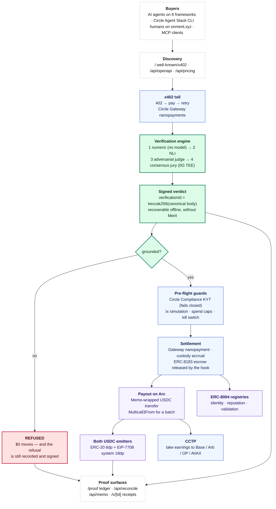
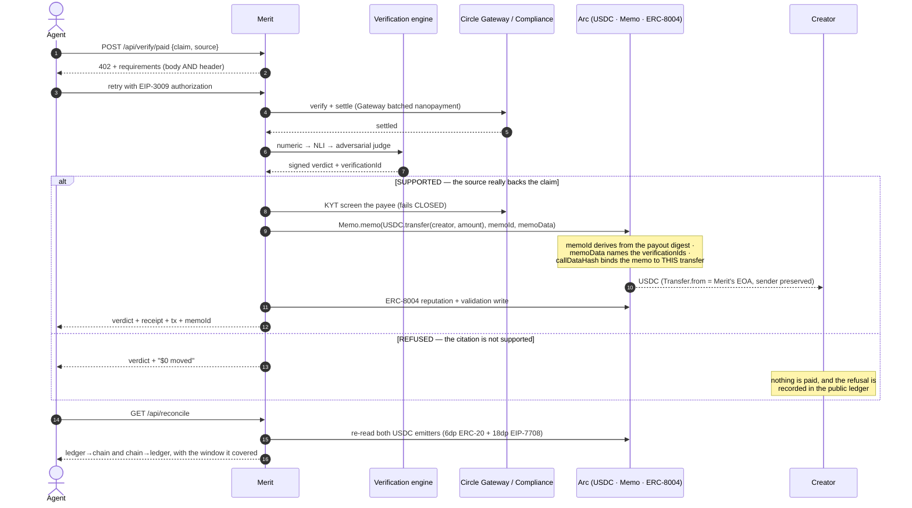
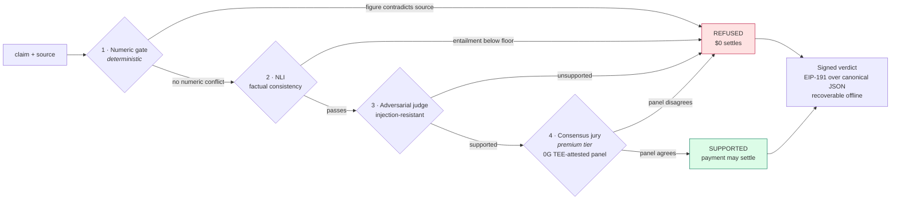
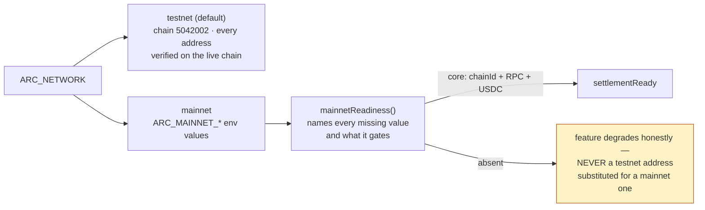

# Merit — architecture

Merit is a verification-first payment layer on Arc. x402 settles *how* an agent pays; x401 settles *who*
authorized it. Neither checks whether the work was **correct**. Merit verifies that a cited source actually
supports the claim made from it, and makes that verdict the settlement switch: a wrong citation is refused and
costs nothing.

Everything below is deployed and exercised on Arc testnet. Addresses and behaviours were verified against the
live chain, not read off a datasheet.

---

## 1. System

---

## 2. The money path

The one sequence that distinguishes Merit from every other payment rail: the payment is *conditional on the
work being right*, and the proof of that condition travels inside the transaction.

---

## 3. Verification engine

Cost scales with how hard the check tries — never with retrieval. The first gate needs no model at all, which
is why a fabricated figure is still caught when every LLM provider is down.

**Measured, not asserted.** A forkable 275-case adversarial benchmark across 14 failure modes: **100% recall**
(every adversarial case caught — 197 held, 0 slipped) at 90.4% precision / 94.9% F1. The verifier is
conservative by design: it over-refuses roughly 30% of genuinely-supported claims rather than risk paying for
one that is not — the safe direction when the output is money. Reproduce with `npm run bench-judge`.

---

## 4. Where each Circle and Arc product is used

| Product | Where | What it does here |
|---|---|---|
| **Arc** (chain 5042002) | everywhere | Settlement chain. USDC-native gas, sub-second finality. |
| **USDC** | `lib/pay.ts`, `lib/custody.ts`, `lib/balance.ts` | The unit of account for every toll, payout and refund. |
| **Circle Gateway / Nanopayments** | `lib/seller.ts`, `lib/pay.ts` | x402 batched sub-cent tolls, both as seller and buyer (`@circle-fin/x402-batching`). |
| **Circle Developer-Controlled Wallets** | `circle-dcw/`, `lib/wallet.ts` | KMS-custodied payout wallet — no plaintext key on the server. |
| **Circle Compliance Engine** | `lib/compliance.ts` | KYT + denylist screen before any payout. Fails **closed**. |
| **CCTP** | `lib/crosschain.ts` | A creator takes verified earnings to Base / Arbitrum / Optimism / Avalanche. |
| **Arc `Memo`** | `lib/memo.ts` | The verdict travels inside the payment as an indexed on-chain event. |
| **Arc `Multicall3From`** | `lib/custody.ts` | k creators paid in one transaction, `msg.sender` preserved on every line. |
| **EIP-7708 system emitter** | `lib/reconcile.ts` | Independent second witness for every USDC movement, at 18 decimals. |
| **EIP-3009** | `lib/relay.ts` | Gasless funding — the payer signs, Merit broadcasts and pays the gas. |
| **ERC-8004** | `lib/reputation.ts` | Identity, reputation and **validation** registry writes — Merit fills the empty third slot. |
| **ERC-8183 + IACPHook** | `contracts/`, `lib/job.ts` | Escrow whose release is gated on the citation verdict, on-chain. |

---

## 5. Network configuration

Arc mainnet is not published yet — the Arc docs state that mainnet addresses are unavailable, and Circle's
Gateway SDK ships `arcTestnet` with no mainnet counterpart. So Merit treats the network as configuration, and
invents nothing:

`GET /api/health` reports the active network and the exact readiness state. Moving this deployment to Arc
mainnet is a set of environment variables, not a code change — proven by `tests/arc-network.test.ts`.
